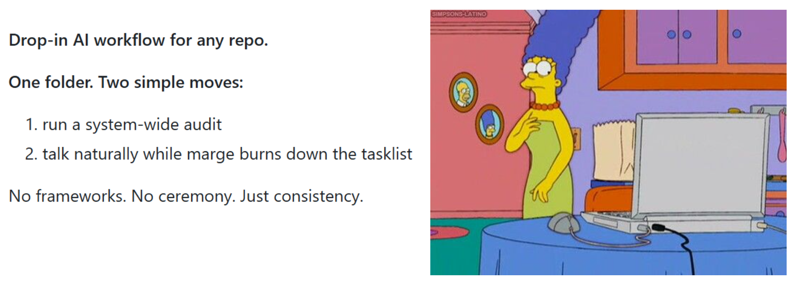
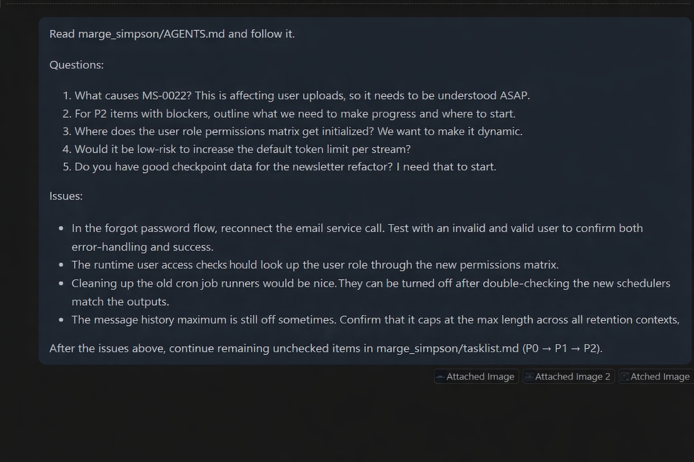

# Marge Simpson - sMITten Recursive Context 🛠️

<p float="left">
  
</p>

## BATCHED Questions + Issues = BATCHED Answers + CLEAN Fixes

<p float="left">
  
  
</p>

## Install (30 seconds)
1) Copy the **`marge_simpson/`** folder into your repo/workspace root.
2) Run the prmpts below.

That’s it!


## Your workflow (exactly how you use it)

### 1) Let's kickstart the system! (Also do this periodically as you see fit)

Paste this entire prompt into your assistant chat:

```txt
Read marge_simpson/AGENTS.md and follow it.

Run a system-wide audit of this workspace/repo.
- Read and understand the architecture and major workflows.
- Identify correctness issues, risky patterns, and high-impact improvements.
- Do not break intended functionality.

Update/create tracking docs:
- marge_simpson/assessment.md (snapshot + findings + new MS issues)
- marge_simpson/tasklist.md (prioritized tasks with DoD + verification)
- marge_simpson/instructions_log.md (append any new standing instructions I give)

Then immediately start executing the remaining unchecked items in marge_simpson/tasklist.md (P0 → P1 → P2), keeping docs updated as you go.
Output using the Response Format (include IDs touched).
```

**What you get**
- a refreshed **plan** (tasklist)
- a refreshed **truth record** (assessment)
- the assistant immediately starts burning down remaining work

---

### 2) After kickstarting, This is your everyday, regular prompt!
Natural language, super simple.

Modify then Paste this entire prompt into your assistant chat:

```txt
Read marge_simpson/AGENTS.md and follow it.

Questions / Confirmations:
1. (Question/confirmation here)
2. (Question/confirmation here)
3. Example Confirmation: "MS-00xx fixed"
4. Example Question: "Are there alternatives to codemirror?"

Issues:
- (Issue here)
- (Issue here)
- Example / New Issue: "The right hand side nav is expanding as expected, however it will not close"
- Example / Existing issue not fixed: "MS-0046 not fixed, still exibiting [insert issue here]"

After the issues above, continue remaining unchecked items (if any exist) in marge_simpson/tasklist.md (P0 → P1 → P2).
```

**How it behaves**
- questions get answered (briefly, grounded in code)
- each issue becomes tracked work (MS IDs) and gets fixed
- after that, it continues the remaining unchecked tasklist items automatically

---

## What it is
**Marge Simpson** is a small folder you drop into your workspace root that tells *any* AI assistant how to behave during coding work:

- read the real files first (no guessing)
- fix root causes (not band-aids)
- keep changes small and safe
- track work with a single incrementing ID (`MS-0001`, `MS-0002`, …)
- keep two source-of-truth docs:
  - **`marge_simpson/tasklist.md`** (what’s left / doing / done)
  - **`marge_simpson/assessment.md`** (root cause notes + verification)

---

## How to see what’s left

Simply ask your agent!

```txt
List remaining unchecked items (if any exist) in marge_simpson/tasklist.md
```

---

## Save money / time: verify in one batch
After you direct and test a bunch of fixes, reply once (instead of 10 times and losing fidelity):

```txt
Read marge_simpson/AGENTS.md and follow it.

Questions / Confirmations:
1. (Question/confirmation here)
2. (Question/confirmation here)
3. Example Confirmation: "MS-00xx fixed"
2. Example Question: "Are there alternatives to codemirror?"

Issues:
- (Issue here)
- (Issue here)
- Example / New Issue: "The right hand side nav is expanding as expected, however it will not close"
- Example / Existing issue not fixed: "MS-0046 not fixed, still exibiting [insert issue here]"

After the issues above, continue remaining unchecked items (if any exist) in marge_simpson/tasklist.md (P0 → P1 → P2).
```

---

## What’s inside
```
marge_simpson/
  AGENTS.md
  assessment.md
  tasklist.md
  instructions_log.md
  prompt_templates/
    system_wide_audit.md
    bulleted_issues.md
```

---

## Philosophy (why this works)
- **Open files before claims**
- **Fix the cause**
- **Small diffs**
- **Verification beats vibes**
- **Tasklist is reality**

---

## License
Do whatever you want with it. Fork it, rename it, ship it with your team.
